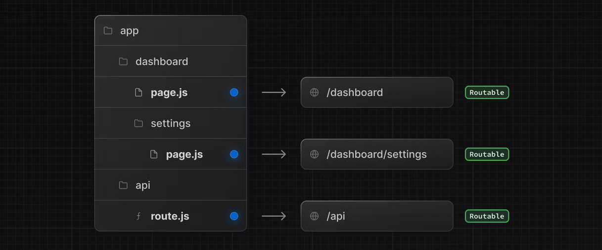
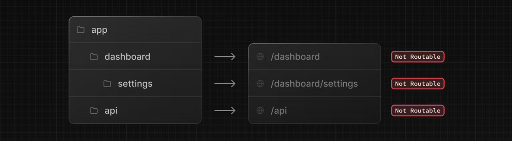
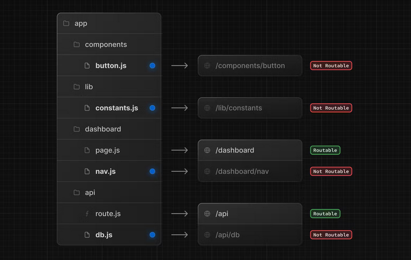
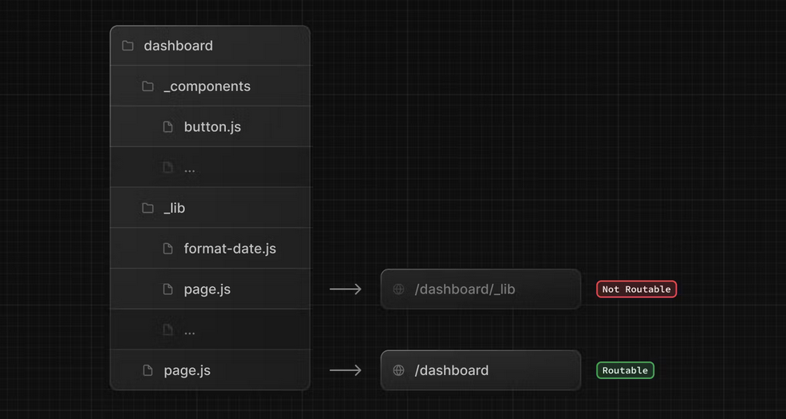
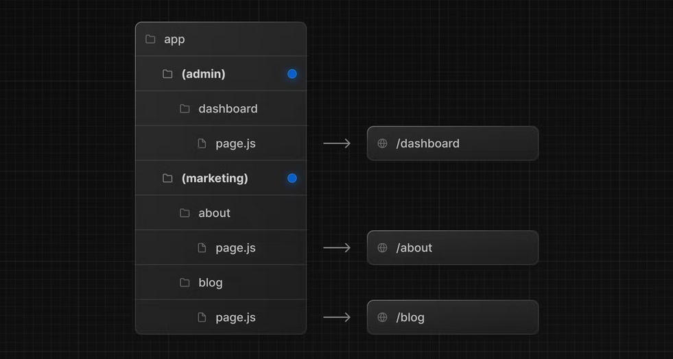
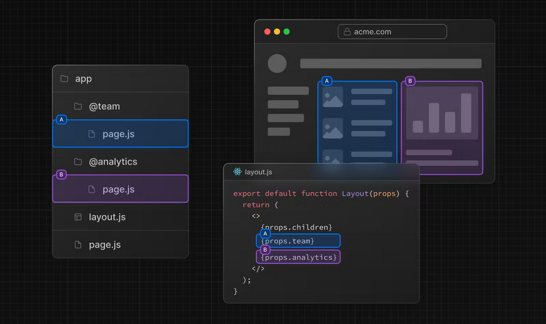
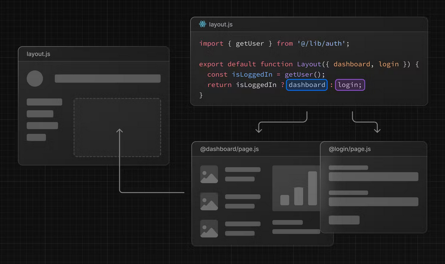

<div align="center">
  <h1>⚙️ Next Demo</h1>
  <p>
    Demonstração de uso e notações utilizadas pelo Next para pastas,
    arquivos e como impacta no roteamento.
  </p>
</div>

## 📑 Conteúdos

- [Rodando o projeto](#hammer_and_wrench-rodando-o-projeto)
- [Organizando a aplicação](#card_file_box-organizando-a-aplicação)
  - [Organização de arquivos](#organização-de-arquivos)
  - [Organização de pastas](#organização-de-pastas)
    - [Opções de organização de pastas](#opções-de-organização-de-pasta)
  - [Rotas Dinâmicas](#rotas-dinamicas)
  - [Rotas Paralelas](#rotas-paralelas)
- [Aprenda mais](#seedling-para-saber-mais)

## :hammer_and_wrench: Rodando o projeto

Após baixar o projeto:

```bash
# instale as dependências
npm i
# or
yarn
# or
pnpm i

# rode o projeto em dev mode
npm run dev
# or
yarn dev
# or
pnpm dev
```

## :card_file_box: Organizando a aplicação

O Next permite com que você siga sua própria organização de projeto,
porém, tomando cuidado com as notações utilizadas pelo framework para
mapear rotas através da **organização das pastas** no diretório 
principal, o `app`, além de definir diferentes tipos de tela 
baseando-se nos **nomes dos arquivos**.

### Organização de arquivos

O Next tem uma nomenclatura de nomes de arquivos de acordo com sua
utilidade, são elas:

| nome do arquivo | função |
| --------------- | ------ |
| [`error`](https://nextjs.org/docs/app/api-reference/file-conventions/error) | define uma página de erro inesperado para uma determinada rota e seus filhos |
| [`layout`](https://nextjs.org/docs/app/api-reference/file-conventions/layout) | define uma página a ser compartilhada por mais de uma rota |
| [`loading`](https://nextjs.org/docs/app/api-reference/file-conventions/loading) | define uma página de carregamento utilizando o [Suspense](https://nextjs.org/docs/app/building-your-application/routing/loading-ui-and-streaming) |
| [`not-found`](https://nextjs.org/docs/app/api-reference/file-conventions/not-found) | define uma página de not found além do next retornar o erro 404 |
| [`page`](https://nextjs.org/docs/app/api-reference/file-conventions/page) | define uma página única para uma rota |
| [`route`](https://nextjs.org/docs/app/building-your-application/routing/route-handlers) | define as *requests* externas de determinada rota, não podendo estar no mesmo nível de um arquivo `page` |
| [`template`](https://nextjs.org/docs/app/building-your-application/routing/pages-and-layouts#templates) | são similares aos layouts no que se refere a envolver layouts ou pages, mas criam uma nova instância paga cada "filho", estados não são preservados e efeitos são ressincronizados. Por isso, são usados em casos específicos |

> ⚠️ As funções retornadas por essas páginas apenas devem ser feitas
> com `export default`, sem isso, a aplicação quebra. O mesmo que
> acontece o root `layout` e o root `page`.

### Organização de pastas

No diretório principal, podemos criar pastas que irão definir as rotas
da nossa aplicação, por exemplo:



Observe que os nomes das pastas e como estão aninhadas definem os nomes 
das rotas. Além disso, quando não informamos um arquivo `page` ou 
`route`, a pasta não será roteada, pois apenas o conteúdo retornado por
um arquivo page ou route que será enviado para o *client*:



Isso significa que qualquer arquivo que não for nomeado como `page` ou 
`route` não será roteável e se não for um arquivo com um dos nomes
especiais, também não irá ter uma finalidade determinada para o Next. 

<div align="center">
  
</div>

#### Opções de organização de pasta

Como foi dito, se um arquivo não carrega nenhum dos nomes reservados
para uma determinada funcionalidade no Next, ele será apenas um arquivo,
mas o framwork oferece algumas opções de organização de pastas:

- **Pastas privadas:** são pastas que serão ignoradas pelo sistema de
roteamento do Next e podem ser criadas colocando underline na frente
do nome, como:



- **Grupos de rotas:** caso queira trazer uma organização além de
separar as pastas por rotas, podemos fazer a separação por pastas que
não serão adicionadas nas URLs geradas. Para isso, devemos colocar o 
nome da pasta entre parênteses:



> ⚠️ Lembrando que essas convenções não são obrigatórias, mas podem
> ajudar na organização e não ficar dependendo de lembrar as notações
> nomeação reservadas para arquivos especiais do Next.

### Rotas Dinâmicas

Quando você não conhece os segmentos exatos de uma rota com antecedência 
e deseja criar rotas a partir de dados dinâmicos, pode usar segmentos 
dinâmicos que são preenchidos no momento da solicitação ou 
pré-renderizados no momento do build da aplicação.

Uma rota dinâmica pode ser criada seguindo a notação: `[nome_da_pasta]`,
como `[id]`, `[slug]` etc. Esses segmentos são passados através da prop
`params` para as funções de `layout`, `page`, `route` e 
`generateMetadata`.

Por exemplo, um blog poderia incluir a seguinte rota: 
`app/blog/[slug]/page.tsx`, na qual *slug* é o segmento dinâmico para
os posts do blog:

| Rota | URL | params |
| ---- | --- | -------- |
| `app/blog/[slug]/page.js` | `/blog/a` | `{ slug: 'a' }` |

```tsx
interface PageProps {
  params: {
    slug: string;
  }
}

export default function Page({ params }:PageProps) {
  return (
    <div>My Post: {params.slug}</div>
  )
}
```

### Rotas Paralelas

O roteamento paralelo permite que você, simultaneamente ou 
condicionalmente, renderize uma ou mais páginas no mesmo `layout`.
Por exemplo, você pode renderizar, simultaneamente, as páginas de 
`team` e `analytics`:

<div align="center">
  
</div>

Como observado, a notação para criar uma rota paralela é: 
`@nome_da_pasta`. Além disso, essa estrutura de pastas permite com que
o componente em `layout.js` aceite `@team` e `@analytics` slot props e
possa renderizá-las em paralelo juntamente com a prop `children`:

```tsx
export default function Layout(props: {
  children: React.ReactNode
  analytics: React.ReactNode
  team: React.ReactNode
}) {
  return (
    <>
      {props.children}
      {props.team}
      {props.analytics}
    </>
  )
}
```

> 💡 Note que a prop `children` é um slot implícito que não precisa estar 
> ligado a uma pasta. Isso significa que `app/page.js` é equivalente a
> `app/@children/page.js`.

Esse tipo de rota também permite com que possamos renderizar rotas 
condicionalmente baseada em certas condições, como o estado de 
autenticação do usuário:

<div align="center">
  
</div>

## :seedling: Para saber mais

- [A documentação do Next.js](https://nextjs.org/docs) - aprenda sobre 
as features do Next.js e API
- [Aprenda Next.js](https://nextjs.org/learn) - um tutorial Next 
interativo

<hr>

<p align="center">
  Feito com 🤍 por
  <a href="https://www.linkedin.com/in/ana-beatriz-nunes/">
    Ana Beatriz Nunes
  </a>
</p>
